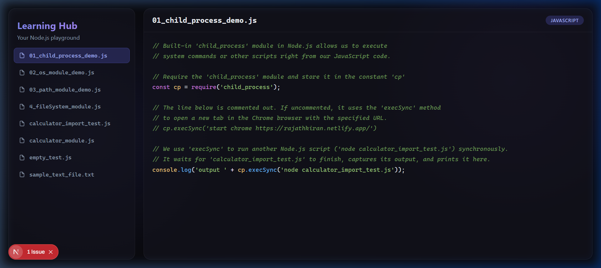
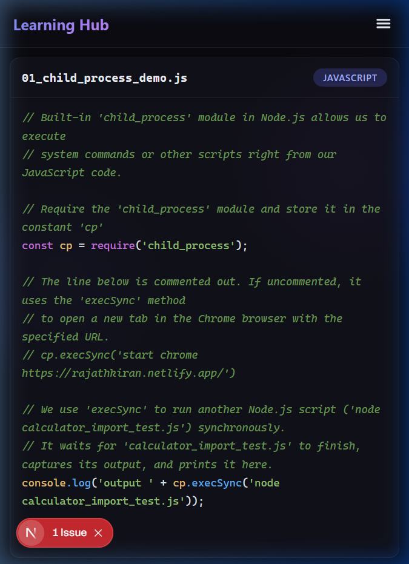
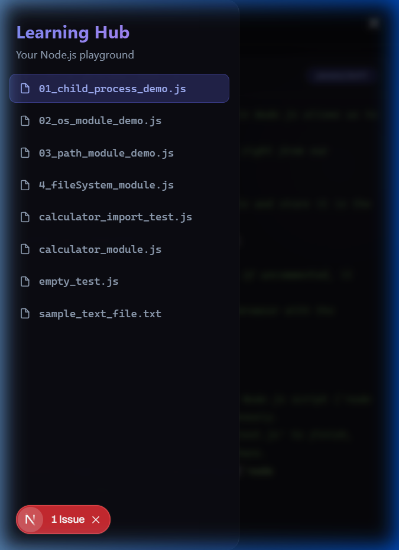

<p align="center">
  
  
  
  
</p>

<h1 align="center">📚 Node.js Learning Hub</h1>

<p align="center">
  <strong>A beautifully crafted web application to learn Node.js — all your scripts, notes, and explanations in one place.</strong>
</p>

<p align="center">
  Built with ❤️ by <a href="https://github.com/Rajath2005">Rajath</a> while learning Node.js with Scaler
</p>

---

## ✨ Features

| Feature | Description |
|---|---|
| 🎨 **Glassmorphism UI** | Stunning dark-mode interface with frosted glass panels, gradient accents, and smooth animations |
| 🌈 **Syntax Highlighting** | Custom React-based tokenizer that color-codes keywords, strings, comments, methods, and numbers |
| 📱 **Mobile Responsive** | Slide-out drawer navigation, optimized touch targets, and full-width code viewer for phones |
| 📝 **Inline Comments** | Every script is thoroughly commented line-by-line to explain what each function and module does |
| ⚡ **Static Generation** | Files are read at build time — zero API calls, instant page loads |
| 🚀 **Auto-Deploy** | Push to `main` → Vercel automatically rebuilds with your latest learning files |

---

## 🖥️ Desktop View

<p align="center">
  
</p>

---

## 📱 Mobile Views

<p align="center">
  
  &nbsp;&nbsp;&nbsp;
  
</p>

---

## 🗂️ Learning Files

| File | Module | What You'll Learn |
|---|---|---|
| `01_child_process_demo.js` | `child_process` | Running system commands and other scripts from Node.js |
| `02_os_module_demo.js` | `os` | Fetching system info — CPU, memory, platform, uptime |
| `03_path_module_demo.js` | `path` | Working with file extensions, basenames, `__filename` & `__dirname` |
| `4_fileSystem_module.js` | `fs` | Reading and writing files with the filesystem module |
| `calculator_module.js` | `module.exports` | Creating reusable functions and exporting them as a custom module |
| `calculator_import_test.js` | `require()` | Importing and using a custom module in another file |

---

## 🎨 Syntax Highlighting Color Guide

```
Comments    → 🟢 Green italic     // This is a comment
Keywords    → 🟣 Purple            const, function, require
Built-ins   → 🟡 Yellow            console, path, os, fs
Methods     → 🔵 Blue              .log(), .execSync(), .arch()
Strings     → 🟢 Light Green       'child_process'
Numbers     → 🟠 Orange            10, 20, 156
```

---

## 🛠️ Tech Stack

- **Framework:** [Next.js 16](https://nextjs.org/) (App Router, Server Components)
- **Styling:** Vanilla CSS with Glassmorphism design system
- **Syntax Highlighting:** Custom React JSX tokenizer (zero dependencies)
- **Backend:** Node.js `fs` + `path` modules (build-time file reading)
- **Deployment:** [Vercel](https://vercel.com/) (static generation)

---

## 🚀 Getting Started

### Run Locally

```bash
# Clone the repo
git clone https://github.com/Rajath2005/NodeJs.git
cd NodeJs/learning-hub

# Install dependencies
npm install

# Start dev server
npm run dev
```

Then open [http://localhost:3000](http://localhost:3000) in your browser.

### Deploy on Vercel

1. Go to [vercel.com/new](https://vercel.com/new)
2. Import `Rajath2005/NodeJs` from GitHub
3. Set **Framework Preset** → `Next.js`
4. Set **Root Directory** → `learning-hub`
5. Click **Deploy** 🚀

---

## 📖 How It Works

```
Scaler-Nodejs/
├── 01_child_process_demo.js   ← Your commented learning scripts
├── 02_os_module_demo.js
├── 03_path_module_demo.js
├── calculator_module.js
├── calculator_import_test.js
├── sample_text_file.txt
├── screenshots/               ← App screenshots for README
└── learning-hub/              ← Next.js web application
    └── src/app/
        ├── page.js            ← Server Component (reads files at build time)
        ├── LearningHub.js     ← Client Component (interactive UI)
        └── globals.css        ← Glassmorphism design system
```

The **Server Component** (`page.js`) reads all `.js` and `.txt` files from the parent directory at build time using Node.js `fs`. It passes the file contents as props to the **Client Component** (`LearningHub.js`), which renders the interactive sidebar, syntax-highlighted code viewer, and mobile drawer.

---

## 🤝 Contributing

This is a personal learning project! As I progress through the Scaler Node.js course, new modules and files will be added continuously.

---

<p align="center">
  <sub>Made with 💜 while learning Node.js</sub>
</p>
